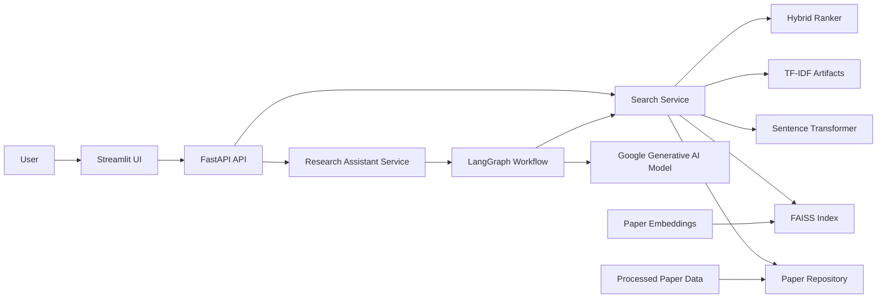
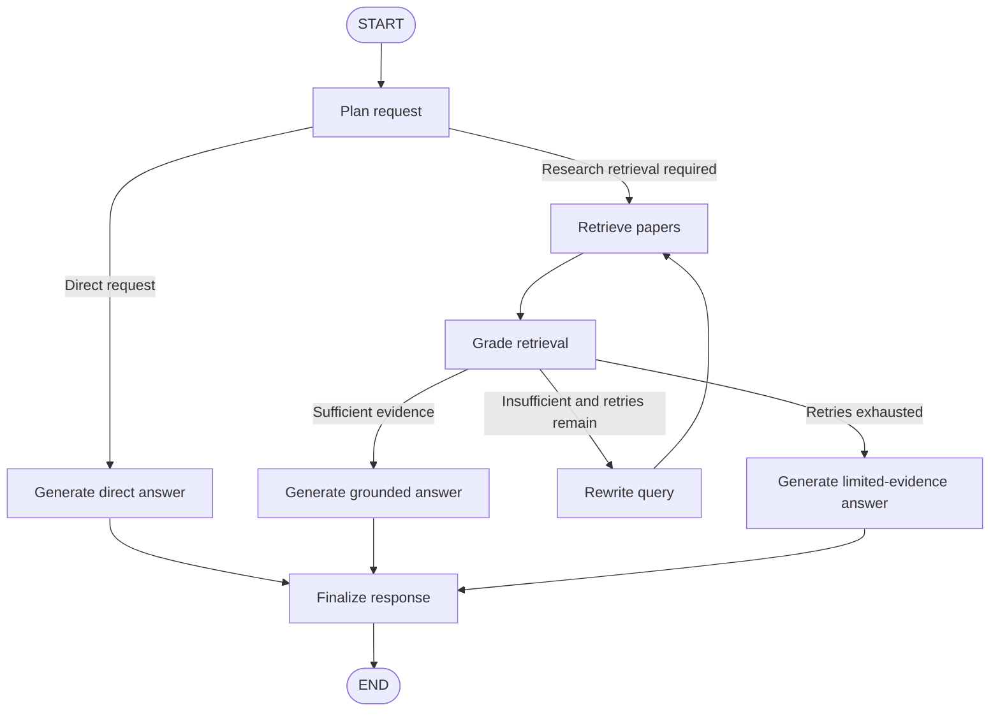
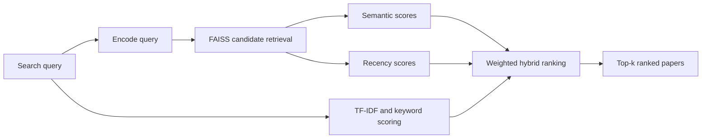

<div style="text-align: center">

# Research Paper Intelligence

**Hybrid scientific-paper retrieval and an evidence-grounded research assistant**

[](https://www.python.org/)
[](https://fastapi.tiangolo.com/)
[](https://streamlit.io/)
[](https://www.docker.com/)
[](https://docs.astral.sh/uv/)
[](LICENSE)

Discover and rank research papers with semantic and lexical retrieval, inspect
why each paper matched, and ask scientific questions through a LangGraph-based
assistant that grounds its answers in retrieved literature.

</div>

---

## Overview

Research Paper Intelligence is an end-to-end scientific search and question-answering application built around an arXiv-derived paper collection. It combines:

- semantic retrieval using sentence-transformer embeddings and FAISS;
- lexical retrieval using TF-IDF;
- keyword-overlap and publication-recency signals;
- configurable hybrid reranking;
- a FastAPI backend;
- a Streamlit user interface;
- an agentic research workflow implemented with LangGraph;
- automated data and artifact preparation through Hugging Face Hub;
- reproducible local and Docker-based execution.

The project separates data preparation, retrieval, ranking, API, user interface,
and assistant orchestration into independently testable modules.

## Key Features

### Hybrid paper search

- Retrieves semantic candidates from a FAISS vector index.
- Computes TF-IDF similarity for lexical relevance.
- Measures direct keyword overlap.
- Applies an exponential publication-recency score.
- Combines all signals into a configurable hybrid score.
- Returns component-level scores and a human-readable match explanation.
- Supports between 1 and 100 results per request.

The default ranking function is:

```text
hybrid_score =
    0.75 × semantic_similarity
  + 0.10 × tfidf_similarity
  + 0.10 × keyword_overlap
  + 0.05 × recency_score
```

The weights, candidate pool size, and recency half-life are configurable through
environment variables.

### Agentic research assistant

The research assistant uses a stateful LangGraph workflow to:

1. classify the request as direct or retrieval-dependent;
2. construct a standalone search query and determine the requested result count;
3. retrieve relevant papers through the existing hybrid search service;
4. grade whether the evidence is sufficient;
5. rewrite and retry weak retrieval queries;
6. generate either a grounded answer or a transparent limited-evidence answer;
7. preserve conversation state using a thread identifier.

### Streamlit interface

The frontend contains three pages:

- **Home** — backend status, loaded-resource metrics, and retrieval configuration;
- **Paper Search** — query form, ranked result list, score breakdown, paper details,
  and direct arXiv links;
- **Research Assistant** — multi-turn scientific chat with suggested prompts and
  conversation reset controls.

### API and system observability

- FastAPI OpenAPI documentation.
- Health endpoint for container and deployment checks.
- System endpoint exposing loaded paper, FAISS, TF-IDF, model, and API metadata.
- Pydantic validation for all public request and response schemas.

### Reproducible runtime data

The preparation pipeline downloads available files from the project's Hugging
Face dataset repository and generates missing artifacts locally:

- raw paper metadata;
- cleaned paper dataset;
- dense sentence embeddings;
- FAISS vector index;
- TF-IDF vectorizer;
- TF-IDF sparse matrix.

Existing local files are reused unless a forced download is explicitly requested.

## Architecture

### Application architecture



### Assistant workflow



### Search pipeline



## Technology Stack

| Layer               | Technologies                               |
|---------------------|--------------------------------------------|
| Language            | Python 3.12                                |
| Package management  | uv, `pyproject.toml`, `uv.lock`            |
| API                 | FastAPI, Uvicorn, Pydantic                 |
| Frontend            | Streamlit                                  |
| Semantic retrieval  | Sentence Transformers, FAISS               |
| Lexical retrieval   | scikit-learn TF-IDF, SciPy sparse matrices |
| Data processing     | pandas, NumPy                              |
| Agentic workflow    | LangChain, LangGraph                       |
| LLM provider        | Google Generative AI                       |
| Artifact storage    | Hugging Face Hub                           |
| Testing and quality | pytest, coverage, Ruff, mypy               |
| Deployment          | Docker, Docker Compose, GitHub Actions     |

## Project Structure

```text
research-paper-intelligence/
├── .github/                         # GitHub Actions workflows
├── .streamlit/                      # Streamlit configuration
├── data/
│   ├── raw/                         # Downloaded source dataset
│   ├── processed/                   # Cleaned paper metadata
│   └── artifacts/                   # Embeddings and retrieval indexes
├── src/
│   └── research_paper_intelligence/
│       ├── api/                     # FastAPI app, routers, schemas, lifespan
│       ├── assistant/               # LangGraph state, routing, prompts, nodes
│       ├── cli/                     # Runtime and data-preparation commands
│       ├── data/                    # Loading and preprocessing logic
│       ├── domain/                  # Core domain models
│       ├── embeddings/              # Encoder and embedding pipeline
│       ├── ranking/                 # Hybrid scoring components
│       ├── repositories/            # Paper data access
│       ├── retrieval/               # FAISS and TF-IDF index construction
│       ├── services/                # Search and assistant application services
│       ├── storage/                 # Local and Hugging Face artifact I/O
│       ├── ui/                      # Streamlit pages, clients, and components
│       ├── config.py                # Validated environment configuration
│       └── device_config.py         # Device setup
        └── logging_config.py        # Application logging setup
├── tests/                           # Unit and integration tests
├── .dockerignore
├── .env.example
├── .gitignore
├── compose.yaml
├── Dockerfile
├── pyproject.toml
├── uv.lock
└── README.md
```

## Prerequisites

Choose either the Docker or local Python workflow.

### Docker workflow

- Docker Desktop or Docker Engine;
- Docker Compose v2;
- an internet connection during the first artifact preparation;
- a Google AI Studio API key for the research assistant.

### Local workflow

- Python 3.12;
- [uv](https://docs.astral.sh/uv/);
- system support for numerical Python packages and FAISS;
- a Google AI Studio API key for the research assistant.

The paper-search functionality can be prepared without an LLM key, but API
startup currently constructs the assistant service as well. Therefore,
`GOOGLE_API_KEY` must be set when starting the complete backend.

## Quick Start with Docker

### 1. Clone the repository

```bash
git clone https://github.com/federico081997/research-paper-intelligence.git
cd research-paper-intelligence
```

### 2. Create the environment file

```bash
cp .env.example .env
```

On Windows PowerShell:

```powershell
Copy-Item .env.example .env
```

Set your Google API key in `.env`:

```dotenv
GOOGLE_API_KEY=your-google-api-key
```

Never commit the populated `.env` file.

### 3. Build and start the application

```bash
docker compose up --build
```

During the first run, the preparation service downloads the dataset and available
artifacts. Missing embeddings or indexes are generated locally. Startup can take
several minutes depending on network speed, CPU performance, and cache state.

Once all services are healthy, open:

- Streamlit application: `http://localhost:8501`
- FastAPI documentation: `http://localhost:8000/docs`
- API health check: `http://localhost:8000/api/v1/health`

Run in detached mode:

```bash
docker compose up --build --detach
```

Inspect service logs:

```bash
docker compose logs --follow
```

Stop the application:

```bash
docker compose down
```

Remove containers and project volumes only when you intentionally want to clear
persisted runtime data:

```bash
docker compose down --volumes
```

## Local Development Setup

### 1. Clone and enter the repository

```bash
git clone https://github.com/federico081997/research-paper-intelligence.git
cd research-paper-intelligence
```

### 2. Install the locked dependencies

```bash
uv sync --frozen
```

### 3. Configure the environment

```bash
cp .env.example .env
```

At minimum, provide:

```dotenv
GOOGLE_API_KEY=your-google-api-key
```

### 4. Prepare the dataset and retrieval artifacts

Run the complete preparation sequence:

```bash
uv run sh src/research_paper_intelligence/cli/prepare_runtime_data.sh
```

The equivalent individual commands are:

```bash
uv run python -m research_paper_intelligence.cli.preprocess_dataset
uv run python -m research_paper_intelligence.cli.generate_embeddings
uv run python -m research_paper_intelligence.cli.generate_faiss_index
uv run python -m research_paper_intelligence.cli.generate_tfidf_index
```

### 5. Start the API

```bash
uv run python -m research_paper_intelligence.cli.run_api
```

The default API address is `http://127.0.0.1:8000`.

### 6. Start the Streamlit frontend

Open a second terminal and run:

```bash
uv run python -m research_paper_intelligence.cli.run_app
```

The default frontend address is `http://127.0.0.1:8501`.

## Environment Configuration

Configuration is validated by `pydantic-settings`. Most application variables use
the `RPI_` prefix. `GOOGLE_API_KEY` is intentionally read without that prefix.

A practical development configuration is:

```dotenv
# Required for the research assistant
GOOGLE_API_KEY=your-google-api-key

# Application
RPI_ENVIRONMENT=development
RPI_LOG_LEVEL=INFO
RPI_DEVICE=auto

# FastAPI
RPI_API_HOST=127.0.0.1
RPI_API_PORT=8000
RPI_API_RELOAD=true
RPI_API_TIMEOUT_SECONDS=10.0
RPI_API_ASSISTANT_TIMEOUT_SECONDS=30.0

# Streamlit
RPI_STREAMLIT_HOST=127.0.0.1
RPI_STREAMLIT_PORT=8501
RPI_STREAMLIT_HEADLESS=true
RPI_STREAMLIT_RUN_ON_SAVE=true

# Embeddings
RPI_EMBEDDING_MODEL_NAME=sentence-transformers/all-MiniLM-L6-v2
RPI_EMBEDDING_BATCH_SIZE=32

# Hybrid ranking
RPI_CANDIDATE_TOP_K=100
RPI_HALF_LIFE_YEARS=5.0
RPI_SEMANTIC_WEIGHT=0.75
RPI_TFIDF_WEIGHT=0.10
RPI_KEYWORD_WEIGHT=0.10
RPI_RECENCY_WEIGHT=0.05

# Assistant
RPI_MODEL_PROVIDER=google_genai
RPI_MODEL_NAME=gemini-3.5-flash-lite
RPI_RETRIEVAL_K=5
RPI_MAX_QUERY_REWRITES=2
```

The four hybrid ranking weights must sum to `1.0`; invalid configurations fail
at application startup.

For containers, bind public-facing processes to all interfaces:

```dotenv
RPI_API_HOST=0.0.0.0
RPI_STREAMLIT_HOST=0.0.0.0
RPI_API_RELOAD=false
```

## Data and Generated Artifacts

Default local paths are:

| Resource          | Path                                     |
|-------------------|------------------------------------------|
| Raw papers        | `data/raw/arxiv_papers.csv`              |
| Processed papers  | `data/processed/arxiv_cleaned.csv`       |
| Paper embeddings  | `data/artifacts/paper_embeddings.npy`    |
| FAISS index       | `data/artifacts/faiss_paper_index.bin`   |
| TF-IDF vectorizer | `data/artifacts/tfidf_vectorizer.joblib` |
| TF-IDF matrix     | `data/artifacts/tfidf_matrix.npz`        |

Remote data and precomputed artifacts are loaded from:

[Hugging Face Dataset: `Federico081997/research-paper-intelligence-data`](https://huggingface.co/datasets/Federico081997/research-paper-intelligence-data)

### Preparation behavior

| Command                | Behaviour                                                               |
|------------------------|-------------------------------------------------------------------------|
| `preprocess_dataset`   | Downloads raw paper metadata and writes the cleaned dataset.            |
| `generate_embeddings`  | Downloads existing embeddings, or generates them from processed papers. |
| `generate_faiss_index` | Downloads an existing index, or builds one from embeddings.             |
| `generate_tfidf_index` | Downloads TF-IDF artifacts, or builds them from processed papers.       |

## API Reference

Interactive documentation is available at:

- Swagger UI: `http://localhost:8000/docs`
- ReDoc: `http://localhost:8000/redoc`

### Health check

```http
GET /api/v1/health
```

Example:

```bash
curl http://localhost:8000/api/v1/health
```

```json
{
  "status": "healthy"
}
```

### System information

```http
GET /api/v1/system/
```

Returns the loaded paper count, embedding model, retrieval strategy, ranking
components, FAISS metadata, TF-IDF metadata, and API version.

```bash
curl http://localhost:8000/api/v1/system/
```

### Search papers

```http
GET /api/v1/search/?query={query}&result_k={result_k}
```

Constraints:

- `query`: 1–500 characters;
- `result_k`: 1–100, default `10`.

Example:

```bash
curl --get "http://localhost:8000/api/v1/search/" \
  --data-urlencode "query=finite volume methods for solid mechanics" \
  --data-urlencode "result_k=5"
```

Each result includes:

- paper metadata;
- rank;
- semantic score;
- TF-IDF score;
- keyword-overlap score;
- recency score;
- final hybrid score;
- ranking explanation.

### Research assistant

```http
POST /api/v1/assistant/chat
Content-Type: application/json
```

Example:

```bash
curl --request POST "http://localhost:8000/api/v1/assistant/chat" \
  --header "Content-Type: application/json" \
  --data '{
    "user_query": "Compare finite-volume and finite-element methods for solid mechanics.",
    "thread_id": "550e8400-e29b-41d4-a716-446655440000"
  }'
```

Example response shape:

```json
{
  "response": "Evidence-grounded answer with paper citations...",
  "thread_id": "550e8400-e29b-41d4-a716-446655440000"
}
```

Reuse the same UUID4 `thread_id` to continue a conversation. Generate a new UUID4
to start an independent thread.

## Testing and Code Quality

Run the test suite:

```bash
uv run pytest
```

Run tests with coverage:

```bash
uv run pytest --cov=research_paper_intelligence --cov-report=term-missing
```

Run Ruff checks:

```bash
uv run ruff check .
uv run ruff format --check .
```

Apply automatic formatting:

```bash
uv run ruff format .
```

Run static type checking:

```bash
uv run mypy src tests
```

A useful local verification sequence is:

```bash
uv run ruff check .
uv run ruff format --check .
uv run mypy src tests
uv run pytest
```

## Configuration and Design Notes

### Why hybrid retrieval?

Semantic retrieval is effective when a query and paper express the same idea with
different terminology. TF-IDF and keyword signals preserve exact technical terms,
acronyms, model names, and mathematical language. Recency provides a small,
controlled preference for newer work without overwhelming relevance.

### Why retrieve candidates before reranking?

FAISS efficiently narrows the full paper collection to a configurable candidate
pool. More detailed lexical and recency calculations are then applied only to that
smaller set, reducing query-time computation.

### Why separate the assistant from the search service?

The assistant reuses the deterministic search implementation rather than
reimplementing retrieval inside the LLM workflow. This keeps ranking behavior
consistent between the search page, API consumers, and generated answers.

### Current limitations

- Search is restricted to papers present in the indexed dataset.
- A high hybrid score estimates relevance; it does not establish scientific quality.
- The current in-memory LangGraph checkpointer is not suitable for durable,
  multi-instance production deployments.
- Generated answers should be verified against the cited papers.
- The current API startup requires the assistant model configuration even when only
  the search endpoint is needed.
- Production deployment still requires appropriate authentication, rate limiting,
  persistent state, monitoring, and secret management.

## Roadmap

- Persistent conversation checkpoints using a database-backed saver.
- Citation-validation and paper-reference evaluation.
- Search filters for category, author, and publication date.
- Retrieval-quality benchmarks and regression tests.
- Improved query analytics and ranking diagnostics.
- Authentication, rate limiting, and production observability.
- Deployment templates for a managed cloud environment.

## Contributing

Contributions should follow the existing modular architecture and include tests for
new behavior.

1. Create a feature branch.
2. Implement the change with focused tests.
3. Run Ruff, mypy, and pytest locally.
4. Open a pull request describing the motivation, implementation, and validation.

## License

Copyright 2026 Federico Mazzanti.

This project is licensed under the Apache License 2.0. See the
[LICENSE](LICENSE) file for details.

## Acknowledgements

This project builds on the work of the arXiv research community and the open-source
ecosystems around Hugging Face, Sentence Transformers, FAISS, scikit-learn,
FastAPI, Streamlit, LangChain, and LangGraph.